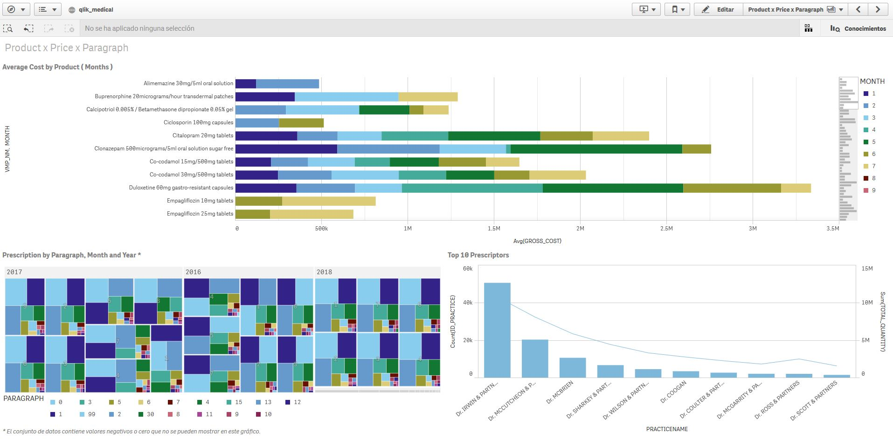

# Norther Ireland medical report

- [Norther Ireland medical report](#norther-ireland-medical-report)
  - [Description](#description)
  - [Motivation](#motivation)
  - [Analytical Uses](#analytical-uses)
  - [Tools](#tools)
  - [Datasets and Sources](#datasets-and-sources)
    - [GP Practices](#gp-practices)
      - [Files](#files)
      - [Fields](#fields)
    - [BNF](#bnf)
      - [Fields](#fields-1)
    - [GP Prescribing](#gp-prescribing)
      - [Files](#files-1)
      - [Fields](#fields-2)
  - [Other datasets](#other-datasets)
    - [Northern Ireland Population](#northern-ireland-population)
    - [Northern Ireland Population Projection](#northern-ireland-population-projection)
  - [Datamodel and design](#datamodel-and-design)
  - [Tasks](#tasks)
    - [tasks: 001 DB Tables (SQL)](#tasks-001-db-tables-sql)
    - [tasks: 002 ETL (Python)](#tasks-002-etl-python)
      - [Config](#config)
      - [Libs - Router](#libs---router)
    - [tasks: 003 DB Bulk (SQL)](#tasks-003-db-bulk-sql)
  - [Usage](#usage)
    - [Note:](#note)
    - [A: Load original datasets (optional)](#a-load-original-datasets-optional)
    - [B: Analysis - Dashboards ( Qlik Sense Cloud )](#b-analysis---dashboards--qlik-sense-cloud)
  - [Qlik Boards](#qlik-boards)

## Description

The government of Ireland has made available a datset of the prescriptions made by medical practices.

https://openprescribing.net/

## Motivation
The purpose of this project is to collect this information and create a system that allows analize and visualize the results.

## Analytical Uses
- To know the evolution of the prescriptions according to the presentation format.
- Comparison between the different active principles.
- Seasonality of prescriptions.
- Evolutionary population data and projections.
- Categorisation of the active principles according to their cost bands.

## Tools
The tools used are:

- Python 2: ETL tasks
- MS SQL Server 2017: Database
- MS SQL Managment Studio: Database managment
- QlikSesnse Cloud: Analisys and visualization
- Visual Code Studio: Code Editor
- CSView: Large CSv Files Viewer ( https://kothar.net/csview )

## Datasets and Sources

3 datasets are mainly used:
- registration of medical consultations
- list of classifications of pharmaceuticals in the market
- registration of the presciptions carried out

The data come from different sources as described below:

### GP Practices
A quarterly reference file of active GP Practices and their list size (number of registered patients) at the start of each quarter. ( OpenDataNI )

> **Source-link:** https://www.opendatani.gov.uk/dataset/gp-practice-list-sizes/resource/9f9f3b03-d1b9-46f1-9601-0566c8b2e755

For the analysis, a joint list of the records identified by ID has been created, keeping the most current information of the records that appear in different periods.

#### Files
The records used are:

| Year    | Month   | File size |
| :------------- | :------------- | :------------- |
| 2016       | January       | 33,9 Kb |
| 2017       | January       | 34,6 Kb |
| 2018       | January       | 38,5 Kb |
| 2018       | April       | 38,2 Kb |
| 2018       | July       | 38,8 Kb |

**Row size:** 50 - 160 b ( mean: 105b )  
**Format:** csv

#### Fields
| Name | Type | Description |
| :------------- | :------------- | :------------- |
| PracNo | int | Unique practice id |
| PracticeName | str | Practice name |
| Address1,Address2,Address3 | str | Practice address(es) fields|
| Postcode | str | postal code |
| LCG | str | Local Commissioning Groups |
| Registered_Patients | int | Number patients in this period  |

### BNF
The therapeutic classifications defined in the British National Formulary (BNF)

> **Source-link:**
https://openprescribing.net/bnf/

#### Fields
| Name | Type | Description |
| :------------- | :------------- | :------------- |
| BNF chapter | int range:1-23 | Chapter  |
| section | int range:1-99 | Section |
| paragraph | int range:1-99 |  Paragraph |
| description | str | Category description |

**Format:** excel

### GP Prescribing
The data covers prescriptions that are prescribed in Northern Ireland ( data.gov.uk )  

> **Source-link:**
https://data.gov.uk/dataset/a7b76920-bc0a-48fd-9abf-dc5ad0999886/gp-prescribing-data

> **Details:**
http://data.nicva.org/dataset/prescribingstatistics/resource/92e27d6b-ba7c-41db-949e-7374151cf4da  
**Details:**
NI_GP_Prescribing_Explanatory_Notes.pdf

#### Files
Monthly prescriptions data at GP Practice level.

| Year    | Month   | File size (mean) |
| :------------- | :------------- | :------------- |
| 2016       | January - December      | 64 Mb |
| 2017       | January - December      | 64 Mb |
| 2018       | January - August      | 64 Mb |

**Row size:** 50 - 260 b ( mean: 155b )  
**Format:** csv

#### Fields
| Name | Type | Description |
| :------------- | :------------- | :------------- |
| Practice ***** | int | National Practice code |
| Year | int | Year prescription item was dispensed  |
| Month | int | Month prescription item was dispensed  |
| VTM_NM | str | Substance/Product name  |
| VMP_NM | str | Generic name  |
| AMP_NM | str | Branded / Generic name  |
| Presentation | int | The form of the product e.g. tablet, caplet, capsule etc.  |
| Strength | str | The amount of the active ingredient that is present in each dosage  |
| BNFCode ***** | str | British National Formulary code  |
| Items | int | The total number of items for the drug prescribed.  |
| Quantity | int | The total quantity of the drug prescribed  |
| Gross Cost ***** | int | Gross of the drug before any discounts are deducted or fees added.  |
| Actual Cost ***** | int | Net ingredient cost minus an average discount plus a container allowance.  |
| BNF Chapter | int | Product’s therapeutic group Chapter  |
| BNF Section | int | Product’s therapeutic group Section  |

***** Differences in column names between files  

** more info:** NI_GP_Prescribing_Explanatory_Notes.pdf    
see: this repositoty /data/_docs/

## Other datasets

### Northern Ireland Population
> **Source-link:** https://data.gov.uk/dataset/62e7073f-e924-4d3f-81a5-ad45b5127682/population-estimates-for-northern-ireland

Population estimates relate to the population as of 30th June each year, and therefore are often referred to as mid-year estimates. They are used to allocate public funds to the Northern Ireland Executive through the Barnett formula and are widely used by Northern Ireland government departments for the planning of services, such as health and education.  

These statistics are also of interest to those involved in research & academia. They are widely used to express other statistics as a rate, and thus enable comparisons across the United Kingdom and other countries.  
**Source:** nisra.gov.uk   
**Licence:** Open Government Licence   

### Northern Ireland Population Projection
> **Source-link:** https://data.gov.uk/dataset/62e7073f-e924-4d3f-81a5-ad45b5127682/population-estimates-for-northern-ireland

National projections by sex and single year of age are produced every two years for the UK and each of the UK constituent countries by the Office of National Statistics (ONS).  
**Source:** nisra.gov.uk

## Datamodel and design

Fact tables | Metrics
---------|----------
F_PRESCRIBING | Total Items, Total Quantity, Gross Cost, Actual Cost

Dimension Tables | Descriptors | Atributtes
---------|----------|----------
D_TIME |  | month, year
D_BNF | Id_bnf | paragraph, section, chapter
D_PRACTICE | Practice No | PracticeName, Adress1, Address2, Address3, PostCode(A), LCG(A)
D_VTM_NM | VTM_NM |
D_VMP_NM | VMP_NM |
D_AMP_NM | AMP_NM, BNF code, presentation, strength |

Auxiliary | Descriptors | Atributtes
---------|----------|----------
A_POSTCODE  |  | postcode, ID_LCG
A_LCG  |  | LCG

## Tasks
The downloaded data is transformed by a series of scripts.
These eliminate the unnecessary text, unifying column names, deleting invalid characters, etc...  
The scripts are located in the directory `[ROOT_DIR]/tasks/`

### tasks: 001 DB Tables (SQL)
SQL Commands needed for the creation of tables in the D.B.

### tasks: 002 ETL (Python)
Python scripts modify the downloaded data, preparing them for database dump.

#### Config
Each Python script has a .yaml configuration file, in which it is defined:
- version
- path and name of input files
- path and name of output files
- execution parameters

#### Libs - Router
Module that provides absolute paths of the project.

### tasks: 003 DB Bulk (SQL)
SQL Commands for the dump tasks.

## Usage

### Note:
A SQL Server 2017 database was used for the project.  
However, this part is optional, as the data can also be stored and imported into Qlik from files.  The relational part between the "tables" and dimensions can be done in Python using pandas.

In the directory `[ROOT_DIR]/data/stage/prescribing/` you´ll find the necessary files for the analysis task (B). In these files we have already created the existing relations between the table of facts ( prescribing ) and the different dimensions tables.

### A: Load original datasets (optional)

1. Download the data manually, of the 3 main blocks in `[ROOT_DIR]/data/universe/`.
  A list of the necessary files ( **registry.yaml** ) can be found in each destination directory.
    - bnf
    - gp-practices
    - gp-prescribing
2. Prepare the D.B. environment.  
3. Check @todo in files
4. Run the scripts in order:
    - 001 - sql create
    - 002.x - create data ( py )
    - 003 - bulk data

### B: Analysis - Dashboards ( Qlik Sense Cloud )
1. Create an app
2. Import data from `[ROOT_DIR]/data/stage/prescribing/`
3. Adjust relationships if necessary
4. Load the data
5. Create a sheet
6. Add visualizations

For more details about using Qlik Sense Cloud see the directory:  
`[ROOT_DIR]/docu/qlik-sense/qlik-sense.md`

## Qlik Boards

For more information see the directory: 
`[ROOT_DIR]/boards/analysis-result.md`

