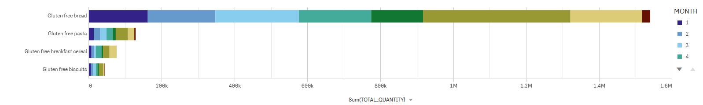
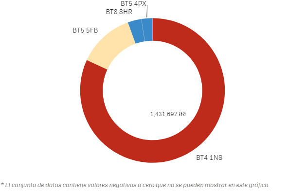

# Analysis results

For the project, different panels have been created to answer certain analytical questions, such as :
- Top products
- Temporal evolution of prescriptions
- Medical Practices with more records
- Grouping of specifications by Postcode

To better exemplify the use of panels the analysis has focused on available products related to gluten.

### Products
#### Products prescribed by Postcode
From the set of zones ( postcode ) we filter the most prescribed products.  
So, we can observe:
- which areas have the highest rate of patients with gluten problems.
- which products are the most prescribed.
and if we limit the filter to the types of food, we get which type of food is most consumed:
eggs, pasta, rice, flour, etc...  
In the same way we can establish a seasonal filter and observe the behaviour of the results in the different months and years.

###### All Products >

###### Products related to gluten >

From the results we can observe that the top product is "Gluten free bread".    

By filtering the search, we reduce the list of products to all those that contain the word 'gluten' in the name.  

######  Evolution of the units prescribed by Year >

###### Total of the units prescribed by Month >

### Practices
These same data can be compared in another dashboard, focusing on medical practices:

In the filter have been applied the 4 highlighted products related to gluten and the period of most activity.
We obtain the practices that more prescriptions have made:
It is possible to delimit by ranges according to the number of units prescribed and distinguish between zones (Postcode).

By a timeline allows to observe the evolution of prescriptions by zone ( Postcode ).
The index of the horizontal axis corresponds to the index of the time interval, groupped by month and year.  

